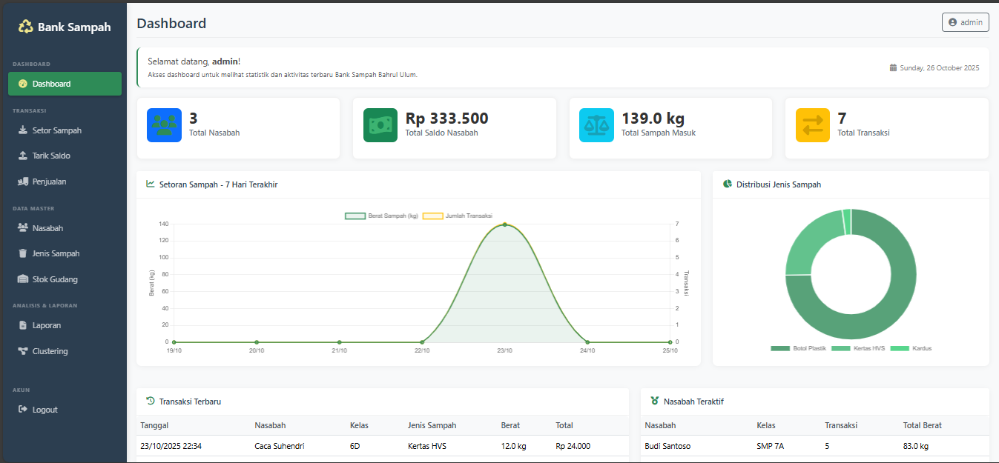
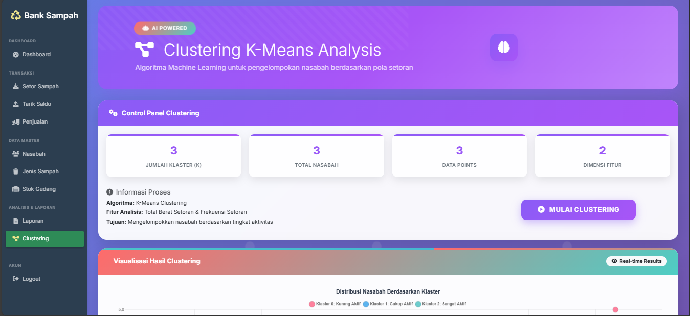

# 🏦♻️ Bank Sampah Digital

<div align="center">
  
  
  
  
</div>

<div align="center">
  <h3>🌱 Sistem Manajemen Bank Sampah Modern & User-Friendly</h3>
  <p>Digitalisasi pengelolaan sampah untuk lingkungan yang lebih bersih dan berkelanjutan</p>
</div>

---

## 📋 Deskripsi

Bank Sampah Digital adalah platform web modern yang dirancang untuk memudahkan pengelolaan bank sampah. Sistem ini memungkinkan nasabah untuk mengelola tabungan sampah mereka secara digital, sementara admin dapat memantau dan mengelola seluruh operasional bank sampah dengan efisien.

## ✨ Fitur Utama

### 👥 Untuk Nasabah
- 📊 **Dashboard Personal** - Pantau saldo dan riwayat transaksi
- 💰 **Setoran Sampah** - Catat setoran sampah dengan mudah
- 📈 **Laporan Tabungan** - Lihat perkembangan tabungan sampah
- 👤 **Profil Management** - Kelola informasi personal

### 🔧 Untuk Admin
- 📊 **Dashboard Admin** - Overview lengkap operasional bank sampah
- 👥 **Manajemen Nasabah** - Kelola data nasabah
- 🗂️ **Manajemen Kategori Sampah** - Atur jenis dan harga sampah
- 💳 **Proses Transaksi** - Validasi dan proses setoran/penarikan
- 📊 **Laporan Komprehensif** - Generate laporan operasional

## 🛠️ Teknologi yang Digunakan

- **Backend**: PHP 7.4+
- **Database**: MySQL 5.7+
- **Frontend**: HTML5, CSS3, JavaScript (ES6+)
- **Framework CSS**: Bootstrap 4/5
- **Server**: Apache (XAMPP/WAMP recommended)

## 🚀 Quick Start

### Prerequisites
- PHP 7.4 atau lebih tinggi
- MySQL 5.7 atau lebih tinggi
- Apache Web Server
- Web browser modern

### Instalasi

1. **Clone repository**
   ```bash
   git clone https://github.com/xnuvers007/bank-sampah-kmeans.git
   cd bank-sampah-kmeans
   ```

2. **Setup Database**
   ```bash
   # Import database
   mysql -u root -p < database/mydb.sql
   
   # Atau melalui phpMyAdmin
   # Import file database/mydb.sql
   ```

3. **Konfigurasi Database**
   ```php
   // Edit config/database.php atau file konfigurasi yang sesuai
   define('DB_HOST', 'localhost');
   define('DB_USER', 'root');
   define('DB_PASS', '');
   define('DB_NAME', 'bank_sampah');
   ```

4. **Jalankan Aplikasi**
   ```bash
   # Pastikan XAMPP/WAMP sudah berjalan
   # Akses melalui browser: http://localhost/bank_sampah
   ```

## 👤 Default Login

### Admin
- **Username**: `admin`
- **Password**: `admin123`

### Nasabah Demo
- **Username**: `siswa1`
- **Password**: `siswa1`

## 📱 Screenshot

<div align="center">
  
  
</div>

## 🗂️ Struktur Project

```
bank_sampah/
├── 📁 assets/          # CSS, JS, Images
├── 📁 config/          # Konfigurasi database
├── 📁 database/        # SQL files
├── 📁 docs/           # Dokumentasi
├── 📁 lib/       # File PHP library KMeans
├── 📁 admin/          # Halaman aplikasi Admin
├── 📁 nasabah/        # Halaman aplikasi Nasabah
├── 📄 index.php       # Entry point
├── 📄 README.md       # Dokumentasi ini
└── 📄 LICENSE         # Lisensi
```

## 🤝 Contributing

Kami sangat menghargai kontribusi dari komunitas! Silakan baca [CONTRIBUTING.md](CONTRIBUTING.md) untuk panduan lengkap cara berkontribusi.

### Cara Berkontribusi:
1. Fork repository ini
2. Buat branch fitur (`git checkout -b feature/AmazingFeature`)
3. Commit perubahan (`git commit -m 'Add some AmazingFeature'`)
4. Push ke branch (`git push origin feature/AmazingFeature`)
5. Buat Pull Request

## 🐛 Bug Reports & Feature Requests

Jika Anda menemukan bug atau memiliki ide fitur baru, silakan buat [issue](https://github.com/Xnuvers007/bank-sampah-kmeans/issues) di GitHub.

## 📞 Support & Contact

- 📧 Email: xnuversh1kar4@gmail.com
- 👨🏻‍💻 Github: Xnuvers007

## 📄 License

Project ini dilisensikan under MIT License - lihat file [LICENSE](LICENSE) untuk detail lengkap.

## 🙏 Acknowledgments

- Terima kasih kepada semua kontributor yang telah membantu pengembangan project ini
- Inspirasi dari komunitas lingkungan dan sustainability
- Icons by [Feather Icons](https://feathericons.com/)

---

<div align="center">
  <p>Made with ❤️ for a cleaner environment</p>
  <p>🌍 Mari bersama-sama menjaga kelestarian lingkungan! 🌱</p>
</div>

